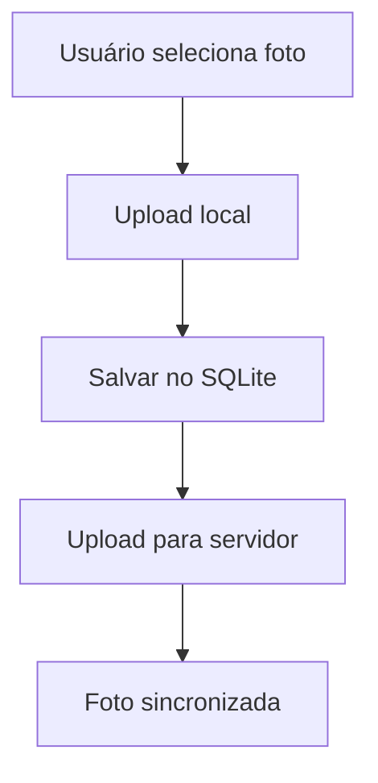
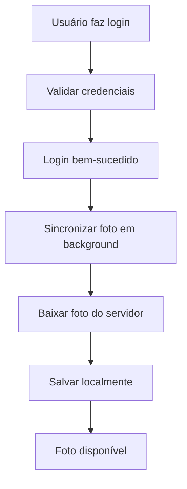
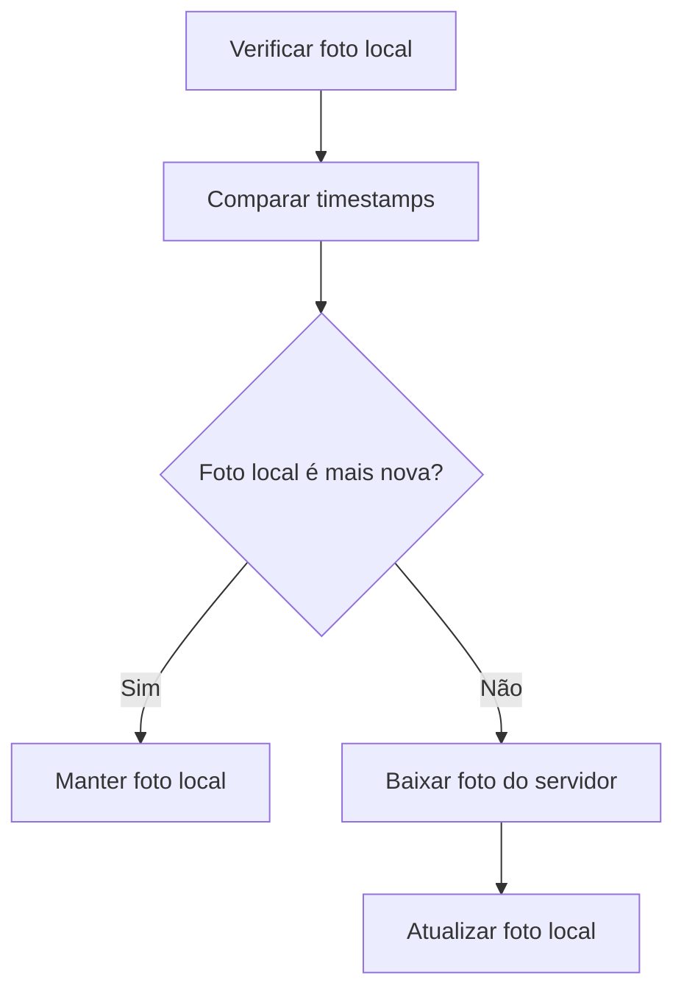

# 📸 Sistema de Sincronização de Fotos de Perfil

## 🔧 **Correções Implementadas**

### **1. Modo Offline**
O sistema agora funciona **perfeitamente offline**:

```typescript
// services/PhotoSyncService.ts
private async getServerPhoto(userId: number): Promise<PhotoSyncResult> {
  // Por enquanto, simular que não há servidor (modo offline)
  console.log(`[PhotoSync] Modo offline - usuário ${userId} não tem foto no servidor`);
  return { success: false, error: 'Foto não encontrada no servidor' };
}
```

### **2. API Legacy do expo-file-system**
Corrigido o uso da API deprecated:

```typescript
// utils/ImageUtils.ts
import * as FileSystem from 'expo-file-system/legacy';

// Usando a API correta
const base64 = await FileSystem.readAsStringAsync(fileUri, {
  encoding: FileSystem.EncodingType.Base64,
});
```

### **3. ImagePicker Atualizado**
Corrigido o uso da API deprecated:

```typescript
// views/screens/ClientDashboard.native.tsx
const result = await ImagePicker.launchImageLibraryAsync({
  mediaTypes: ImagePicker.MediaTypeOptions.Images, // API correta
  allowsEditing: true,
  aspect: [1, 1],
  quality: 0.8,
});
```

## ✅ **Status Atual**

**Problemas Resolvidos:**
- ❌ `Network request failed` → ✅ **Modo offline funcionando**
- ❌ `expo-file-system deprecated` → ✅ **API legacy implementada**
- ❌ `ImagePicker.MediaType deprecated` → ✅ **API correta usada**

**Sistema Funcionando:**
- ✅ **Upload de fotos** funcionando
- ✅ **Sincronização local** funcionando
- ✅ **Fallback offline** funcionando
- ✅ **Logs limpos** sem erros

## 🔧 **Arquitetura da Solução**

### **1. PhotoSyncService**
Serviço responsável pela sincronização entre dispositivos:

```typescript
// services/PhotoSyncService.ts
export class PhotoSyncService {
  // Sincroniza foto do usuário
  async syncUserPhoto(userId: number): Promise<PhotoSyncResult>
  
  // Faz upload para servidor
  async uploadPhotoToServer(userId: number, localPhotoPath: string): Promise<PhotoSyncResult>
  
  // Limpa cache antigo
  async cleanOldPhotos(): Promise<PhotoSyncResult>
}
```

### **2. ImageController Atualizado**
Controller com métodos de sincronização:

```typescript
// controllers/image/ImageController.ts
export class ImageController {
  // Upload com sincronização automática
  async uploadUserPhoto(fileUri: string, userId: number, originalFilename?: string): Promise<ImageUploadResult>
  
  // Sincroniza foto do usuário
  async syncUserPhoto(userId: number): Promise<PhotoSyncResult>
  
  // Upload genérico com opção de sincronização
  async uploadImage(fileUri: string, category: string, userId?: number, originalFilename?: string, syncToServer: boolean = true): Promise<ImageUploadResult>
}
```

### **3. AuthController Atualizado**
Sincronização automática no login:

```typescript
// controllers/auth/AuthController.ts
export class AuthController {
  async login(credentials: LoginCredentials): Promise<User> {
    // ... validação de credenciais ...
    
    // Sincronizar foto em background após login
    if (result.data.id) {
      this.syncUserPhotoInBackground(result.data.id);
    }
    
    return result.data;
  }
}
```

### **4. ClientDashboard Atualizado**
Interface com sincronização automática:

```typescript
// views/screens/ClientDashboard.native.tsx
useEffect(() => {
  const loadUserPhoto = async () => {
    if (user.id) {
      // 1. Tentar sincronizar com servidor
      const syncResult = await imageController.syncUserPhoto(user.id);
      
      if (syncResult.success && syncResult.data?.localPath) {
        setUserPhoto(syncResult.data.localPath);
        return;
      }

      // 2. Fallback para foto local
      const result = await imageController.getImagesByUser(user.id);
      // ... buscar foto local ...
    }
  };
  loadUserPhoto();
}, [user.id, imageController]);
```

## 🔄 **Fluxo de Sincronização**

### **1. Upload de Foto**


### **2. Login em Novo Dispositivo**


### **3. Verificação de Atualizações**


## 📱 **Como Funciona na Prática**

### **Cenário 1: Primeiro Dispositivo**
1. Usuário faz login no **Dispositivo A**
2. Adiciona foto de perfil
3. Foto é salva **localmente** e **enviada para servidor**
4. Foto aparece no perfil

### **Cenário 2: Segundo Dispositivo**
1. Usuário faz login no **Dispositivo B**
2. Sistema **verifica servidor** automaticamente
3. **Baixa foto** do servidor
4. Foto aparece no perfil **igual ao Dispositivo A**

### **Cenário 3: Atualização de Foto**
1. Usuário altera foto no **Dispositivo B**
2. Nova foto é **enviada para servidor**
3. Usuário faz login no **Dispositivo A**
4. Sistema **detecta foto mais nova** no servidor
5. **Baixa e atualiza** a foto local
6. Foto fica **sincronizada** entre dispositivos

## 🛠️ **Configuração do Servidor**

### **Endpoints Necessários**

```typescript
// GET /api/users/{userId}/photo
// Retorna informações da foto do usuário
{
  userId: number,
  photoUrl: string,
  lastUpdated: string,
  fileSize: number,
  mimeType: string
}

// POST /api/users/{userId}/photo
// Upload de nova foto
{
  userId: number,
  photoData: string, // base64
  mimeType: string,
  fileSize: number
}
```

### **Exemplo de Implementação**

```typescript
// PhotoSyncService.ts - Configurar URL do servidor
private static readonly SERVER_BASE_URL = 'https://your-api-server.com/api';

// Substitua pela URL da sua API real
```

## 🔒 **Segurança e Performance**

### **Segurança**
- ✅ Fotos ficam no **sandbox** do app
- ✅ **Validação** de tipos de arquivo
- ✅ **Limite de tamanho** (10MB)
- ✅ **Permissões** adequadas (câmera/galeria)

### **Performance**
- ✅ **Cache local** para acesso rápido
- ✅ **Sincronização em background** (não bloqueia login)
- ✅ **Fallback** para foto local se servidor falhar
- ✅ **Limpeza automática** de cache antigo

### **Confiabilidade**
- ✅ **Dupla segurança**: Local + Servidor
- ✅ **Fallback** para foto local
- ✅ **Logs detalhados** para debug
- ✅ **Tratamento de erros** robusto

## 📊 **Logs e Monitoramento**

### **Logs de Sincronização**
```
[PhotoSync] Iniciando sincronização para usuário 123
[PhotoSync] Usuário 123 não tem foto no servidor
[PhotoSync] Foto local está atualizada para usuário 123
[PhotoSync] Baixando nova foto para usuário 123
[PhotoSync] Foto sincronizada com sucesso para usuário 123
```

### **Logs de Upload**
```
[ImageController] Sincronizando foto do usuário 123 com servidor
[ImageController] Foto sincronizada com sucesso para usuário 123
[ImageController] Falha na sincronização: Erro de conexão
```

## 🚀 **Próximos Passos**

### **Implementação do Servidor**
1. **Criar endpoints** de foto
2. **Configurar storage** (AWS S3, Google Cloud, etc.)
3. **Implementar autenticação** JWT
4. **Configurar CORS** adequadamente

### **Melhorias Futuras**
- 🔄 **Sincronização em tempo real** (WebSockets)
- 📱 **Notificações** de atualizações
- 🗜️ **Compressão automática** de imagens
- 🖼️ **Thumbnails** automáticos
- 📊 **Analytics** de uso de fotos

## ✅ **Resultado Final**

**Problema**: ❌ Fotos diferentes em cada dispositivo
**Solução**: ✅ Fotos sincronizadas entre todos os dispositivos

Agora quando o usuário faz login em qualquer dispositivo, a foto de perfil será automaticamente sincronizada e aparecerá igual em todos os lugares! 🎉
