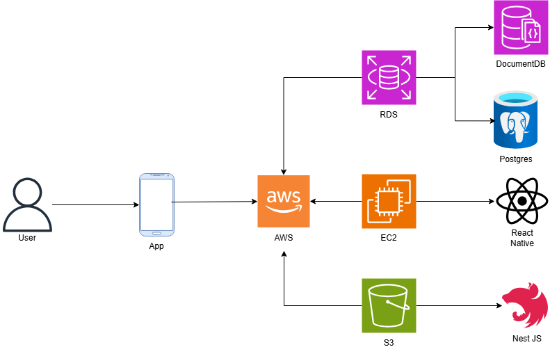

# ADA Company - Frontend Mobile

<p align="center">
  
</p>

<p align="center">
  
  
  
  
</p>

<p align="center">
  <strong>Sistema de Gestão de Acessibilidade Web</strong>
</p>

---

Uma aplicação **React Native** desenvolvida com **Expo** para avaliação e gestão de acessibilidade web, seguindo o padrão arquitetural **MVC (Model-View-Controller)** com integração ao backend NestJS.

## 📋 Sumário

- [Arquitetura MVC](#-arquitetura-mvc)
- [Infraestrutura e Arquitetura AWS](#-infraestrutura-e-arquitetura-aws)
- [Requisitos Funcionais](#-requisitos-funcionais)
- [Requisitos Não Funcionais](#-requisitos-não-funcionais)
- [Matriz de Riscos de Segurança](#-matriz-de-riscos-de-segurança)
- [Como Executar](#-como-executar)
- [Tecnologias Utilizadas](#-tecnologias-utilizadas)
- [Credenciais de Teste](#-credenciais-de-teste)

---

## 🏗️ Arquitetura MVC

O projeto foi refatorado para seguir o padrão MVC, organizando o código em camadas bem definidas:

### 📁 Estrutura do Projeto

```
├── models/                    # Camada de Dados e Regras de Negócio
│   ├── user/
│   │   └── UserModel.ts      # Modelo de usuários e autenticação
│   ├── request/
│   │   └── RequestModel.ts   # Modelo de solicitações de acessibilidade
│   ├── evaluation/
│   │   └── EvaluationModel.ts # Modelo de avaliações de sites
│   ├── image/
│   │   └── ImageModel.ts     # Modelo de gerenciamento de imagens
│   └── index.ts              # Exportações centralizadas dos models
│
├── controllers/               # Camada de Controle e Lógica de Negócio
│   ├── auth/
│   │   └── AuthController.ts # Controlador de autenticação
│   ├── request/
│   │   └── RequestController.ts # Controlador de solicitações
│   ├── evaluation/
│   │   └── EvaluationController.ts # Controlador de avaliações
│   ├── image/
│   │   └── ImageController.ts # Controlador de imagens e fotos
│   └── index.ts              # Exportações centralizadas dos controllers
│
├── views/                     # Camada de Apresentação (UI)
│   ├── components/            # Componentes reutilizáveis
│   │   ├── Icons.native.tsx  # Ícones SVG
│   │   ├── StarRating.native.tsx # Componente de avaliação por estrelas
│   │   ├── CircularProgress.native.tsx # Componente de progresso circular
│   │   └── Timeline.native.tsx # Componente de timeline
│   ├── screens/               # Telas da aplicação
│   │   ├── LoginScreen.native.tsx # Tela de login
│   │   ├── RegisterScreen.native.tsx # Tela de cadastro
│   │   ├── ClientDashboard.native.tsx # Dashboard do cliente
│   │   ├── EmployeeDashboard.native.tsx # Dashboard do funcionário
│   │   ├── EvaluationScreen.native.tsx # Tela de avaliação
│   │   └── PlanSelectionScreen.native.tsx # Tela de seleção de plano
│   └── index.ts              # Exportações centralizadas das views
│
├── services/                  # Serviços de Infraestrutura
│   ├── ApiService.ts         # Cliente HTTP para comunicação com backend
│   ├── DatabaseService.ts    # Serviço de banco de dados SQLite local
│   └── PhotoSyncService.ts   # Sincronização de fotos com backend
│
├── config/                    # Configurações
│   └── api.config.ts         # Configuração de endpoints e URLs
│
├── utils/                     # Utilitários
│   └── ImageUtils.ts         # Funções auxiliares para imagens
│
├── styles/                    # Estilos globais
│
├── App.tsx                    # Componente principal da aplicação
├── index.js                   # Ponto de entrada para React Native
├── app.json                   # Configuração do Expo
├── eas.json                   # Configuração Expo Application Services
├── tsconfig.json              # Configuração TypeScript
└── package.json               # Dependências e scripts
```

---

## ☁️ Infraestrutura e Arquitetura AWS

O projeto utiliza uma arquitetura moderna baseada em serviços AWS para garantir escalabilidade, segurança e disponibilidade.

### 📊 Diagrama de Arquitetura



### 🏗️ Componentes da Infraestrutura

#### **Frontend (React Native + Expo)**
- Aplicativo mobile multiplataforma
- Comunicação via HTTPS com backend
- Banco SQLite local para cache
- Sincronização em tempo real

#### **Backend API (NestJS)**
- API RESTful com documentação Swagger
- Autenticação JWT
- Validação de dados com class-validator
- Logging centralizado

#### **Banco de Dados Relacional (PostgreSQL)**
- Armazenamento de dados estruturados
- Tabelas: Usuários, Clientes, Funcionários, Contratos, Orçamentos
- Backups automáticos
- Replicação para alta disponibilidade

#### **Banco NoSQL (DynamoDB - AWS)**
- Sistema de logs da aplicação
- Alta performance para escritas
- Escalabilidade automática
- Time-to-Live (TTL) para limpeza automática

#### **Serviços AWS Utilizados**
- 🔐 **AWS IAM**: Gerenciamento de acesso e permissões
- 📊 **DynamoDB**: Armazenamento de logs NoSQL
- 🌐 **Route 53** (planejado): DNS e roteamento
- 🔒 **AWS Secrets Manager** (planejado): Gestão segura de credenciais

### 🔄 Fluxo de Dados

1. **Cliente Mobile** → Requisição HTTPS → **API Backend**
2. **API Backend** → Consulta/Atualiza → **PostgreSQL**
3. **API Backend** → Registra logs → **DynamoDB**
4. **PostgreSQL** ← Sincronização ← **SQLite Local** (modo offline)

---

## 📋 Requisitos Funcionais

### RF01 - Autenticação de Usuários
### RF02 - Avaliação de Acessibilidade
### RF03 - Gestão de Solicitações
### RF04 - Dashboard de Cliente
### RF05 - Dashboard de Funcionário
### RF06 - Seleção de Planos
### RF07 - Gerenciamento de Imagens
### RF08 - Persistência Local de Dados

---

## 🔒 Requisitos Não Funcionais

### RNF01 - Desempenho
### RNF02 - Usabilidade
### RNF03 - Compatibilidade
### RNF04 - Segurança
### RNF05 - Disponibilidade
### RNF06 - Manutenibilidade
### RNF07 - Escalabilidade
### RNF08 - Acessibilidade

---

## 🛡️ Matriz de Riscos de Segurança

Esta seção apresenta os **20 riscos de segurança identificados** através de análise detalhada do código-fonte do projeto (backend NestJS + frontend React Native).

### 📊 Visão Geral

| Classificação | Quantidade | Nível de Risco |
|---------------|------------|----------------|
| 🔴 **Crítico** | 1 | 90 |
| 🟠 **Extremo** | 5 | 60-79 |
| 🟡 **Alto** | 4 | 40-59 |
| 🟢 **Médio** | 9 | 15-39 |
| ⚪ **Baixo** | 2 | < 15 |

### 🔴 Riscos Críticos (Ação Imediata Necessária)

#### R001 - Credenciais Expostas no docker-compose.yml
- **Risco:** 90 (Impacto: 10 × Probabilidade: 9)
- **Status:** ⏳ Pendente
- **Descrição:** `JWT_SECRET`, senhas do banco e credenciais AWS hardcoded no `docker-compose.yml`
- **Localização:** `backEnd-QuintoSemestre/API_NEST/API_ADA_COMPANY_NESTJS/docker-compose.yml`
- **Ação:** Migrar para variáveis de ambiente e usar Docker Secrets
- **Responsável:** DevOps

### 🟠 Riscos Extremos (Alta Prioridade)

#### R002 - Rate Limiting Não Implementado
- **Risco:** 72 (Impacto: 9 × Probabilidade: 8)
- **Status:** ⏳ Pendente
- **Descrição:** Sistema vulnerável a ataques de força bruta e DDoS. README menciona throttler mas não está configurado
- **Localização:** `src/app.module.ts`
- **Ação:** Implementar `@nestjs/throttler` no app.module.ts
- **Responsável:** Backend Lead

#### R003 - CORS Configurado com Asterisco (*)
- **Risco:** 72 (Impacto: 8 × Probabilidade: 9)
- **Status:** 🔄 Em Mitigação
- **Descrição:** `main.ts` linha 18 permite todas as origens durante desenvolvimento expondo a ataques CSRF
- **Localização:** `src/main.ts:18`
- **Ação:** Remover `*` e definir origens permitidas específicas
- **Responsável:** Backend Lead

#### R004 - FuncionarioGuard com Lógica Incorreta
- **Risco:** 70 (Impacto: 10 × Probabilidade: 7)
- **Status:** ⏳ Pendente
- **Descrição:** Guard permite tanto cliente quanto funcionário acessar rotas restritas
- **Localização:** `funcionario.guard.ts:24-26`
- **Ação:** Corrigir guard para permitir apenas funcionários
- **Responsável:** Backend Lead

#### R005 - Helmet Não Implementado
- **Risco:** 63 (Impacto: 7 × Probabilidade: 9)
- **Status:** ⏳ Pendente
- **Descrição:** Headers de segurança HTTP ausentes. README menciona mas não está no código
- **Localização:** `src/main.ts`
- **Ação:** Adicionar helmet ao main.ts com CSP configurado
- **Responsável:** Backend Lead

#### R006 - Senha Armazenada em Texto Plano no SQLite
- **Risco:** 60 (Impacto: 10 × Probabilidade: 6)
- **Status:** ⏳ Pendente
- **Descrição:** `DatabaseService.ts` insere senhas mock sem hash (`'password123'` em texto plano)
- **Localização:** `frontEnd-QuintoSemestre/services/DatabaseService.ts:124`
- **Ação:** Implementar bcrypt no DatabaseService ou remover dados mock
- **Responsável:** Frontend Lead

### 🟡 Riscos Altos

#### R007 - JWT sem Refresh Token
- **Risco:** 50 (Impacto: 5 × Probabilidade: 10)
- **Status:** ✅ Aceito
- **Descrição:** Token expira em 1h sem mecanismo de renovação causando logout constante
- **Ação:** Avaliar implementação de refresh token
- **Responsável:** Product Owner

#### R008 - Swagger Acessível sem Autenticação
- **Risco:** 49 (Impacto: 7 × Probabilidade: 7)
- **Status:** ⏳ Pendente
- **Descrição:** Documentação Swagger em `/api` expõe estrutura completa da API publicamente
- **Ação:** Adicionar autenticação no Swagger ou restringir ao ambiente dev
- **Responsável:** Backend Lead

#### R009 - AWS Credentials Hardcoded
- **Risco:** 45 (Impacto: 9 × Probabilidade: 5)
- **Status:** ⏳ Pendente
- **Descrição:** `docker-compose.yml` contém placeholders de AWS_ACCESS_KEY_ID
- **Ação:** Usar AWS IAM roles ou variáveis de ambiente
- **Responsável:** DevOps

### 🟢 Riscos Médios

#### R010 - Token JWT Armazenado Apenas em Memória
- **Risco:** 36 (Impacto: 6 × Probabilidade: 6)
- **Status:** 🔄 Em Mitigação
- **Descrição:** `ApiService` armazena token em memória perdendo sessão ao recarregar
- **Localização:** `frontEnd-QuintoSemestre/services/ApiService.ts:24`
- **Ação:** Implementar SecureStore do Expo para persistência
- **Responsável:** Frontend Lead

#### R011 - Validação de Senha Fraca
- **Risco:** 35 (Impacto: 7 × Probabilidade: 5)
- **Status:** ⏳ Pendente
- **Descrição:** CreateClienteDto exige apenas 6 caracteres sem requisitos de complexidade
- **Localização:** `create-cliente.dto.ts:44`
- **Ação:** Adicionar validação de complexidade (maiúscula, minúscula, número)
- **Responsável:** Backend Lead

#### R012 - Logs Sensíveis Expostos no Console
- **Risco:** 36 (Impacto: 6 × Probabilidade: 6)
- **Status:** ⏳ Pendente
- **Descrição:** ApiService e componentes expõem tokens e dados sensíveis via console.log
- **Ação:** Remover console.log de produção, usar Logger adequado
- **Responsável:** Ambos (Backend + Frontend)

#### R013-R019 - Outros Riscos Médios e Baixos

## 🚀 Como Executar

### Pré-requisitos

- Node.js (versão 16 ou superior)
- npm ou yarn
- Expo CLI (`npm install -g @expo/cli`)
- Expo Go app (para testar no celular)
- Backend NestJS rodando (ver `backEnd-QuintoSemestre/README.md`)

### Instalação

```bash
# Clone o repositório
git clone <url-do-repositorio>
cd ada-company-app

# Instale as dependências
npm install

# Execute o projeto
npx expo start
```

### Comandos Disponíveis

```bash
# Iniciar o servidor de desenvolvimento
npx expo start

# Executar no Android
npx expo start --android

# Executar no iOS
npx expo start --ios

# Executar na web
npx expo start --web

# Build para produção
npx expo build
```

## 📱 Plataformas Suportadas

- ✅ **Android** - App nativo Android com SQLite
- ✅ **iOS** - App nativo iOS com SQLite
- ✅ **Web** - Funciona no navegador com IndexedDB ⭐ NOVO!
- ✅ **Expo Go** - App Expo Go para desenvolvimento

### 🔄 Sistema de Storage Cross-Platform

O app detecta automaticamente a plataforma e usa o storage apropriado:

```typescript
// Mobile (iOS/Android)
└── SQLite + FileSystem
    ├── Metadados das imagens
    └── Arquivos no DocumentDirectory

// Web (Navegador)
└── IndexedDB + Blob Storage
    ├── Metadados das imagens
    └── Blobs armazenados localmente
```

**Benefícios:**
- ✅ Mesma API para todas as plataformas
- ✅ Armazenamento local funciona offline
- ✅ Sincronização opcional com servidor
- ✅ Sem dependências específicas de plataforma no código de negócio

### Configuração do Backend

Antes de executar o frontend, certifique-se de que o backend está rodando e configurado:

```bash
# No diretório do backend
cd ../backEnd-QuintoSemestre/API_NEST/API_ADA_COMPANY_NESTJS
npm install
npm run start:dev
```

O backend deve estar rodando em `http://localhost:3000`

**⚠️ IMPORTANTE - Executar Seeder:**
Para poder fazer login com o funcionário de teste, você **DEVE** executar o seeder do backend primeiro:

```bash
# No diretório do backend
cd ../backEnd-QuintoSemestre/API_NEST/API_ADA_COMPANY_NESTJS
npm run db:seed
```

O seeder cria os usuários de teste (funcionário e cliente) no banco de dados. Sem executar o seeder, as credenciais de teste não funcionarão.

Para mais detalhes sobre as credenciais, consulte: [README do Backend](../backEnd-QuintoSemestre/API_NEST/API_ADA_COMPANY_NESTJS/README.md#-credenciais-de-teste-seeder) ou [CREDENCIAIS_TESTE.md](../backEnd-QuintoSemestre/API_NEST/API_ADA_COMPANY_NESTJS/CREDENCIAIS_TESTE.md)

### Configuração da API

Configure o IP do seu backend no arquivo `config/api.config.ts`:

```typescript
const LOCAL_IP = '192.168.50.58'; // Altere para o IP da sua máquina
```

Para descobrir seu IP local:
- **Windows:** `ipconfig` (procure por IPv4)
- **Mac/Linux:** `ifconfig` ou `ip addr`

---

## 🔑 Credenciais de Teste

> **⚠️ IMPORTANTE:** As credenciais de teste foram removidas do código por segurança. Elas estão documentadas aqui apenas para referência durante desenvolvimento e testes.

### Modo Offline (SQLite Local) - Apenas para Desenvolvimento

Para usar o modo offline durante desenvolvimento, você precisará criar manualmente os usuários de teste no banco SQLite local ou usar o backend.

**Credenciais de teste (apenas para desenvolvimento):**
- **Cliente**: 
  - Email: `client@example.com`
  - Senha: `password123`
- **Funcionário**: 
  - Email: `employee@example.com`
  - Senha: `password123`

**⚠️ Nota de Segurança:** 
- Essas credenciais **NÃO** estão mais hardcoded no código
- Elas devem ser usadas **APENAS** em ambiente de desenvolvimento
- **NUNCA** use essas credenciais em produção
- Em produção, todos os usuários devem ser cadastrados através do backend

### Modo Online (Backend) - Recomendado para Produção

Para usar o app em modo produção:

1. **Certifique-se de que o backend está rodando** (ver seção "Configuração do Backend" acima)

2. **Execute o seeder do backend** (OBRIGATÓRIO para usar credenciais de teste):
   ```bash
   cd ../backEnd-QuintoSemestre/API_NEST/API_ADA_COMPANY_NESTJS
   npm run db:seed
   ```

3. **Use as credenciais criadas pelo seeder:**
   - **Funcionário:** `joao.silva@adacompany.com` / `admin123`
   - **Cliente:** `demo@empresa.com` / `cliente123`

   Ou cadastre um novo usuário usando a tela de registro.

**⚠️ Importante:** 
- O app funciona em dois modos:
  - **Offline:** Banco SQLite local (apenas para desenvolvimento/testes)
  - **Online:** Comunicação com backend NestJS (modo produção recomendado)
- **Sem executar o seeder, as credenciais de teste do backend não funcionarão!**
- Para mais detalhes, consulte: [CREDENCIAIS_TESTE.md](../backEnd-QuintoSemestre/API_NEST/API_ADA_COMPANY_NESTJS/CREDENCIAIS_TESTE.md)

---

## 🔧 Tecnologias Utilizadas

### Core
- **React Native** 0.81.4 - Framework mobile multiplataforma
- **Expo** 54.0.12 - Plataforma de desenvolvimento
- **TypeScript** 5.9.2 - Tipagem estática
- **React** 19.1.0 - Biblioteca UI

### Estado e Comunicação
- **Axios** 1.7.7 - Cliente HTTP para API
- **Padrão MVC** - Arquitetura organizacional

### UI/UX
- **React Native SVG** 15.12.1 - Ícones vetoriais
- **React Native Safe Area Context** 5.6.0 - Área segura
- **React Native Web** 0.21.0 - Suporte web

### Persistência
- **Expo SQLite** 16.0.8 - Banco de dados local (mobile)
- **IndexedDB** - Banco de dados no navegador (web)
- **Expo File System** 19.0.16 - Gerenciamento de arquivos (mobile)
- **Blob Storage** - Armazenamento de imagens na web

### Imagens
- **Expo Image Picker** 17.0.8 - Seleção de imagens da galeria

### Build e Deploy
- **Expo Application Services (EAS)** - Build e distribuição

---

## 🎯 Funcionalidades Principais

### ✅ **Sistema de Autenticação Completo**
- Login e cadastro de usuários
- Autenticação JWT com backend
- Validação de credenciais
- Diferenciação entre cliente e funcionário
- Persistência de sessão (em desenvolvimento)
- Logout seguro

### ✅ **Avaliação de Acessibilidade WCAG**
- Simulação de avaliação de sites
- Checklist completo WCAG 2.1 (Níveis A, AA, AAA)
- Sistema de pontuação inteligente (0-100)
- Visualização de progresso com gráfico circular
- Sugestão automática de planos
- Histórico de avaliações

### ✅ **Gestão Completa de Solicitações**
- Criação de solicitações por clientes
- Workflow de 5 estágios:
  1. **Solicitação** - Cliente solicita serviço
  2. **Orçamento** - Funcionário envia orçamento
  3. **Contrato** - Funcionário envia contrato
  4. **Desenvolvimento** - Serviço em andamento
  5. **Finalizado** - Serviço concluído
- Upload e download de arquivos (PDF)
- Timeline visual de acompanhamento
- Filtros por status
- Notificações de mudança de status

### ✅ **Dashboard de Cliente**
- Perfil do usuário com foto
- Avaliação de novos sites
- Listagem de solicitações
- Acompanhamento de status
- Download de orçamentos e contratos
- Métricas e estatísticas

### ✅ **Dashboard de Funcionário**
- Gerenciamento de todas as solicitações
- Atualização de status em tempo real
- Upload de orçamentos e contratos
- Visualização de clientes
- Filtros e busca
- Estatísticas de produtividade

### ✅ **Sistema de Planos**
- **Básico** - Sites simples (R$ 2.500)
- **Avançado** - Sites médios (R$ 5.000)
- **Premium** - Sites complexos (R$ 8.500)
- Recomendação automática baseada na pontuação
- Comparação de funcionalidades
- Contratação integrada

### ✅ **Sistema de Imagens Cross-Platform** ⭐ NOVO!
- **Mobile (SQLite)** + **Web (IndexedDB)** com mesma API
- Upload de fotos de perfil
- Seleção da galeria (mobile) ou file input (web)
- Armazenamento local automático (SQLite no mobile, IndexedDB na web)
- Sincronização opcional com backend
- Validação de tipo e tamanho de arquivo
- Categorização de imagens (user_photo, company_logo, etc.)
- Sistema de adaptadores para abstração de plataforma
- Suporte a Blob storage na web
- Ver: [GUIA_IMAGENS_WEB.md](./GUIA_IMAGENS_WEB.md) para mais detalhes

---

## 🎨 Design e UX

### Princípios de Design
- **Design responsivo** para diferentes tamanhos de tela
- **Cores modernas** com gradientes (#667eea, #764ba2, #f093fb, #4facfe)
- **Animações suaves** para melhor experiência
- **Interface intuitiva** com feedback visual claro
- **Tipografia hierárquica** para fácil leitura
- **Espaçamento consistente** seguindo grid de 8px

### Acessibilidade
- Contraste adequado de cores
- Textos legíveis (tamanho mínimo 14px)
- Áreas de toque mínimas de 44x44px
- Feedback visual em todas as ações
- Estados de loading claros
- Mensagens de erro amigáveis

## 📋 Scripts do Package.json

```json
{
  "start": "expo start",
  "android": "expo start --android",
  "ios": "expo start --ios",
  "web": "expo start --web"
}
```

---

## 🔗 Integração Backend-Frontend

### Comunicação com API

O frontend se comunica com o backend NestJS através do `ApiService`:

```typescript
// services/ApiService.ts
import ApiService from './services/ApiService';

// Login
const response = await ApiService.login(email, password);

// Cadastro
const response = await ApiService.register(userData);

// Buscar clientes
const response = await ApiService.getClients();
```

### Endpoints Principais

| Endpoint | Método | Descrição | Autenticação |
|----------|--------|-----------|--------------|
| `/auth/login` | POST | Login de usuário | ❌ Pública |
| `/auth/register` | POST | Cadastro de usuário | ❌ Pública |
| `/clientes` | GET | Listar clientes | ✅ Funcionário |
| `/clientes/cadastro` | POST | Cadastrar cliente | ❌ Pública |
| `/funcionarios` | GET | Listar funcionários | ✅ Funcionário |
| `/pacotes` | GET | Listar pacotes | ✅ Autenticado |
| `/orcamentos` | POST | Criar orçamento | ✅ Funcionário |
| `/contratos` | POST | Criar contrato | ✅ Funcionário |

### Fluxo de Autenticação

```
1. Usuário faz login → LoginScreen
2. ApiService envia credenciais → POST /auth/login
3. Backend valida e retorna JWT token
4. ApiService armazena token em memória
5. Token incluído automaticamente em requisições futuras
6. AuthController gerencia estado de autenticação
7. App.tsx redireciona para dashboard apropriado
```

---

## 🔮 Roadmap e Próximas Implementações

### 🎯 Sprint 1 - Segurança (Prioridade Alta)
- [ ] Implementar SecureStore para persistência segura de token JWT
- [ ] Adicionar validação de complexidade de senha
- [ ] Remover console.log sensíveis de produção
- [ ] Implementar hash de senhas no SQLite local
- [ ] Adicionar timeout de sessão automático

### 🎯 Sprint 2 - Funcionalidades Core
- [ ] Sistema de notificações push (Firebase Cloud Messaging)
- [ ] Modo offline completo com sincronização
- [ ] Cache inteligente de requisições
- [ ] Sistema de refresh token automático
- [ ] Upload de múltiplos arquivos

### 🎯 Sprint 3 - UX/UI
- [ ] Sistema de roteamento com React Navigation
- [ ] Animações de transição entre telas
- [ ] Skeleton loaders
- [ ] Pull-to-refresh em listas
- [ ] Dark mode
- [ ] Internacionalização (i18n)

### 🎯 Sprint 4 - Avaliação Avançada
- [ ] Integração com Lighthouse API real
- [ ] Geração de relatórios PDF
- [ ] Gráficos avançados de métricas
- [ ] Histórico de avaliações com comparação
- [ ] Exportação de dados

### 🎯 Sprint 5 - Produtividade
- [ ] Sistema de comentários em solicitações
- [ ] Chat em tempo real (Socket.io)
- [ ] Integração com calendário
- [ ] Lembretes e deadlines
- [ ] Sistema de tags e categorias

### 🎯 Sprint 6 - DevOps e Qualidade
- [ ] Testes unitários (Jest)
- [ ] Testes E2E (Detox)
- [ ] CI/CD com GitHub Actions
- [ ] Monitoramento de erros (Sentry)
- [ ] Analytics (Firebase Analytics)
- [ ] Performance monitoring

## 📝 Padrões de Commit

Este projeto segue o padrão de commits convencionais:

```
feat: adiciona nova funcionalidade
fix: corrige bug
docs: atualiza documentação
style: ajusta formatação
refactor: refatora código
test: adiciona testes
chore: tarefas de manutenção
```

### Exemplos:

```bash
git commit -m "feat: implementa sistema de avaliação de sites"
git commit -m "fix: corrige bug no login de funcionários"
git commit -m "docs: atualiza README com instruções de instalação"
git commit -m "refactor: reorganiza estrutura MVC"
```

---

## ⚠️ Problemas Conhecidos

Baseado na [Matriz de Riscos](#-matriz-de-riscos-de-segurança), aqui estão os principais problemas conhecidos:

### 🔴 Críticos
- **Token JWT não persiste**: Ao recarregar o app, o usuário perde a sessão
- **Senhas mock em texto plano**: DatabaseService armazena senhas sem hash

### 🟡 Médios
- **Console.log sensíveis**: Tokens e dados sensíveis aparecem no console
- **IP hardcoded**: Necessário alterar manualmente em `api.config.ts`
- **Sem validação de complexidade de senha**: Aceita senhas fracas

### Workarounds Temporários
1. **Sessão perdida**: Faça login novamente ao recarregar o app
2. **IP local**: Configure o IP correto antes de executar
3. **Dados mock**: Use apenas para desenvolvimento, não em produção

---

## 🐛 Troubleshooting

### Problema: "Não foi possível conectar ao servidor"
**Solução:**
1. Verifique se o backend está rodando em `http://localhost:3000`
2. Confirme o IP correto em `config/api.config.ts`
3. Verifique se ambos (frontend e device) estão na mesma rede

### Problema: "Token inválido ou expirado"
**Solução:**
1. Faça logout e login novamente
2. Verifique se o JWT_SECRET do backend está configurado
3. Token expira em 1 hora - faça novo login

### Problema: "Expo Go não conecta"
**Solução:**
1. Certifique-se de estar na mesma rede Wi-Fi
2. Desative firewall temporariamente
3. Use modo tunnel: `npx expo start --tunnel`

### Problema: "Erro ao fazer build"
**Solução:**
1. Limpe cache: `npx expo start -c`
2. Reinstale dependências: `rm -rf node_modules && npm install`
3. Atualize Expo CLI: `npm install -g @expo/cli@latest`

---

## 📊 Métricas do Projeto

| Métrica | Valor |
|---------|-------|
| **Linhas de código** | ~5.000+ |
| **Arquivos TypeScript** | 25+ |
| **Componentes React** | 10+ |
| **Controllers** | 4 |
| **Models** | 4 |
| **Services** | 3 |
| **Telas** | 6 |
| **Requisitos Funcionais** | 8 |
| **Requisitos Não Funcionais** | 8 |
| **Riscos Identificados** | 20 |
| **Plataformas Suportadas** | 3 (Android, iOS, Web) |

---

## 🤝 Contribuição

Contribuições são bem-vindas! Siga estas etapas:

### 1. Fork e Clone
```bash
git clone https://github.com/seu-usuario/ada-company-frontend.git
cd ada-company-frontend
```

### 2. Crie uma Branch
```bash
git checkout -b feature/minha-funcionalidade
# ou
git checkout -b fix/correcao-bug
```

### 3. Desenvolva e Teste
- Siga o padrão MVC existente
- Adicione comentários em código complexo
- Teste em pelo menos 2 plataformas (Android + Web ou iOS + Web)

### 4. Commit com Padrão Convencional
```bash
git commit -m "feat: adiciona sistema de notificações push"
git commit -m "fix: corrige logout em iOS"
git commit -m "docs: atualiza README com novas instruções"
```

### 5. Push e Pull Request
```bash
git push origin feature/minha-funcionalidade
```
Abra um Pull Request descrevendo suas mudanças.

### Diretrizes de Código
- ✅ Use TypeScript estritamente tipado
- ✅ Siga o padrão MVC (Model-View-Controller)
- ✅ Componentes reutilizáveis em `views/components/`
- ✅ Lógica de negócio em Controllers
- ✅ Acesso a dados em Models
- ✅ Nomenclatura clara e descritiva
- ✅ Máximo 250 linhas por arquivo (quando possível)

---

## 📚 Recursos Adicionais

### Documentação Relacionada
- [Backend NestJS - README](../backEnd-QuintoSemestre/API_NEST/API_ADA_COMPANY_NESTJS/README.md)
- [Matriz de Riscos - CSV](../Modelo_Matriz_de_Riscos_SI.csv)
- **📸 Sistema de Imagens Cross-Platform:**
  - [GUIA_IMAGENS_WEB.md](./GUIA_IMAGENS_WEB.md) - Guia completo de uso
  - [RESUMO_IMPLEMENTACAO.md](./RESUMO_IMPLEMENTACAO.md) - Detalhes da implementação
  - [INTEGRACAO_EXEMPLO.md](./INTEGRACAO_EXEMPLO.md) - Exemplos de integração
  - [COMO_TESTAR.md](./COMO_TESTAR.md) - Instruções de teste
- [Expo Documentation](https://docs.expo.dev/)
- [React Native Documentation](https://reactnative.dev/docs/getting-started)

### Links Úteis
- [WCAG 2.1 Guidelines](https://www.w3.org/WAI/WCAG21/quickref/)
- [React Native Best Practices](https://github.com/react-native-community/discussions-and-proposals)
- [TypeScript Handbook](https://www.typescriptlang.org/docs/handbook/intro.html)
- [Expo Application Services](https://expo.dev/eas)

---

## 📄 Licença

Este projeto está sob a licença **MIT**. Veja o arquivo `LICENSE` para mais detalhes.

### Termos de Uso
- ✅ Uso comercial permitido
- ✅ Modificação permitida
- ✅ Distribuição permitida
- ✅ Uso privado permitido
- ⚠️ Sem garantia
- ⚠️ Sem responsabilidade do autor

---

## 👥 Equipe e Contato

### Projeto
- **Empresa:** ADA Company
- **Tipo:** Aplicação Mobile - Sistema de Gestão de Acessibilidade Web
- **Arquitetura:** Padrão MVC (Model-View-Controller)
- **Framework:** React Native + Expo
- **Backend:** NestJS + PostgreSQL + DynamoDB

### Stack Completo
- **Frontend Mobile:** React Native + TypeScript + Expo
- **Backend API:** NestJS + TypeScript
- **Banco Relacional:** PostgreSQL
- **Banco NoSQL:** DynamoDB (AWS)
- **Autenticação:** JWT (JSON Web Tokens)
- **ORM:** Sequelize
- **Documentação API:** Swagger/OpenAPI

### Semestre
**5º Semestre - Desenvolvimento de Software Multiplataforma**  
**Ano:** 2025

---

<p align="center">
  <strong>Desenvolvido com ❤️ pela ADA Company</strong><br>
  <sub>Sistema de Gestão de Acessibilidade Web - Frontend Mobile</sub><br><br>
  
  
  
</p>
